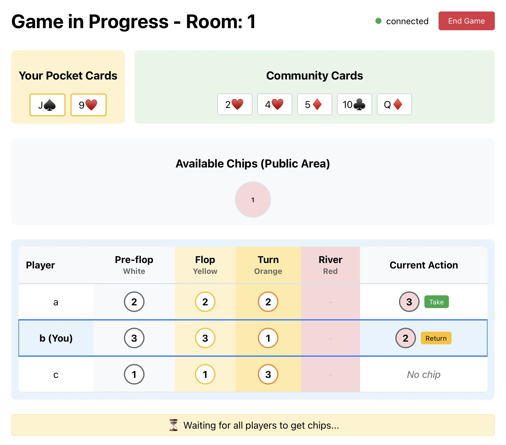

# The Gang - Cooperative Poker Game

A real-time multiplayer cooperative poker variant where players work together to predict hand strengths.



## Setup

### Backend (Django ASGI)

```bash
# Create virtual environment
python3 -m venv venv
source venv/bin/activate

# Install dependencies
pip install -r requirements.txt

# Run Django development server with ASGI support
daphne -p 8000 thegang.asgi:application
```

### Frontend (React)

```bash
# Navigate to frontend directory
cd frontend

# Install dependencies
npm install

# Start React development server
npm start
```

### Usage

1. Start both Django backend (port 8000) and React frontend (port 3000)
2. Open http://localhost:3000 in your browser
3. Enter your player name and room name
4. Wait for other players to join (3-6 players needed)
5. Any player can start the game when enough players are present

## Game Rules

**The Gang** is a cooperative poker game where all players win or lose together based on their ability to correctly predict hand strengths.

### Objective
Work as a team to correctly assign red chips (#1, #2, #3, etc.) to players based on the final strength of their poker hands. Player with red chip #1 should have the weakest hand, #2 the second weakest, and so on.

### Gameplay
1. **Four Rounds**: Pre-flop → Flop → Turn → River → Scoring
2. **Chip Colors**: Each round has a different colored chip (White → Yellow → Orange → Red)
3. **Strategic Bidding**: Players take chips from the public area or steal from other players
4. **Bidding History**: All previous chip selections are visible to help infer hand strengths
5. **Final Prediction**: Red chips in the river round represent your team's prediction of final hand rankings

### Winning Condition
The team wins if the red chip assignments match the actual hand strength rankings. If any red chip is assigned incorrectly, the entire team loses.

### Poker Hand Rankings
Standard poker hands apply (Royal Flush > Straight Flush > Four of a Kind > Full House > Flush > Straight > Three of a Kind > Two Pair > One Pair > High Card).

---

For implementation details and development history, see [prompt.md](prompt.md).